<!DOCTYPE html>
<html>
  <head>
    <title>Implementation af kredsløb</title>
    <meta charset="utf-8">
    
  </head>
  <body>
    <textarea id="source">

# Ingen Kringler - Men A2 kører!

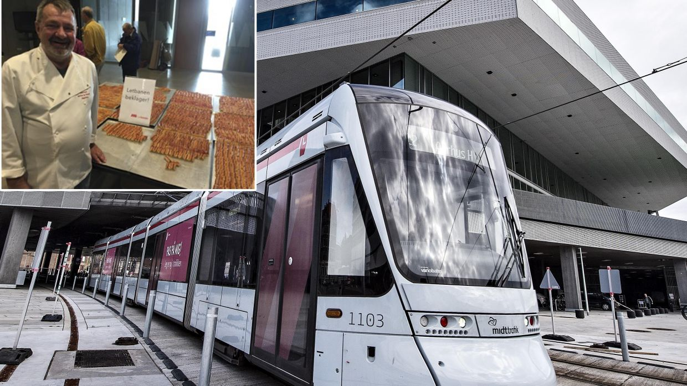

---

# A2 mikroarkitektur

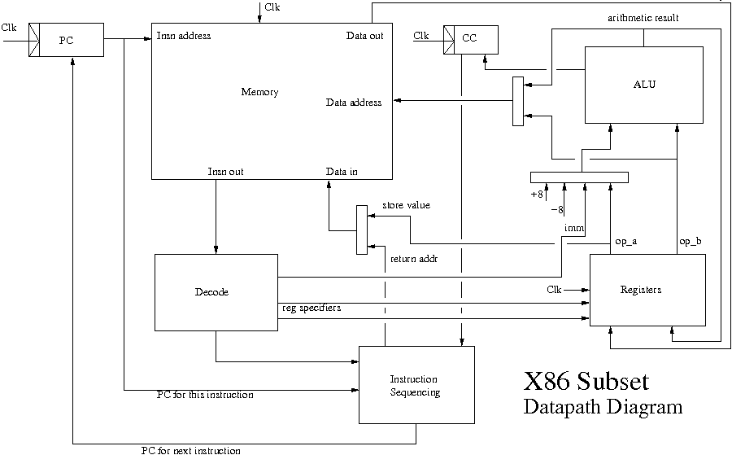

---

# Oversigt over forelæsningerne i maskinarkitektur

1. En essentiel maskine bygget af nogle passende byggeklodser.
   Så simpelt som muligt - men ikke simplere. A2.

2. Et deep dive i hvordan klodserne bygges.
   Masser af detaljer der giver baggrund

3. Pipelining - hvorfor og hvordan?
   Performance! Mere performance! Hvor langt kan man gå? Hvordan?
   Mere realisme

4. Avanceret mikroarkitektur. 
   Parallel udførsel af sekventiel kode. Hvordan?
   "The bureaucracy is expanding to meet the need of the expanding bureaucracy"

5. Multitrådning. Multicore. Opsamling.

---

# Abstraktionsniveuaer

1. Gode programmeringssprog: Erlang, OCaml osv

2. Maskinnære programmeringssprog: C

3. Assembler / Symbolsk Maskinsprog: x86, ARM, MIPS

4. Arkitektur (ISA): Maskinsprog - ordrer indkodet som tal

5. Mikroarkitektur: ting som lager, registre, regneenheder, afkodere
   og hvordan de forbindes så det bliver en maskine

6. Standard celler: Simple funktioner af få bit (1-4) med et eller to resultater. Lagring af data (flip-flops)

7. Transistorer

8. Fysik. Eller noget der ligner

---

# Agenda

Første forelæsning: Nedstigning! Fra store til små byggeklodser

Anden forelæsning: CMOS transistorer, Fremstillingsprocess, Moores lov

---

# Porte. De simpleste byggeklodser

| A | B | A and B | A nand B | A or B | A nor B | A xor B
| --- | :---: | :---: | :---: | :---: | :---: | :---: |
| 0 | 0 | 0 | 1 | 0 | 1 | 0 |
| 0 | 1 | 0 | 1 | 1 | 0 | 1 |
| 1 | 0 | 0 | 1 | 1 | 0 | 1 | 
| 1 | 1 | 1 | 0 | 1 | 0 | 0 |

| A | not A |
|---| :---: |
| 0 | 1 |
| 1 | 0 |

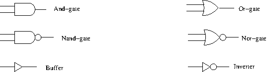

---
# Store klodser laves af små klodser

~~~C
bool eval_condition(conditions c, val op) { // from fig 3.15, p. 242
    bool zf = c.zf;
    bool sf = c.sf;
    bool of = c.of;
    bool res_a = is(ALWAYS, op);
    bool res_le = (is(LE, op) & (bool_xor(sf,of)|zf));
    bool res_lt = (is(LT, op) & bool_xor(sf,of));
    bool res_eq = (is(EQ, op) & zf);
    bool res_ne = (is(NE, op) & bool_not(zf));
    bool res_ge = (is(GE, op) & bool_not(bool_xor(sf,of)));
    bool res_gt = (is(GT, op) & bool_not(bool_xor(sf,of)) & bool_not(zf));
    bool res = res_a | res_le | res_lt | res_eq | res_ne | res_ge | res_gt;
    return res;
}
~~~

---
# Store klodser laves af små klodser (II)

~~~C
alu_execute_result alu_execute(val op, val op_a, val op_b) {
    alu_execute_result result;
    bool is_sub = is(SUB, op) || is(CMP, op);
    bool is_add = is(ADD, op);
    val val_a = or( use_if(!is_sub, op_a), 
		    use_if( is_sub, neg(64, op_a)));
    generic_adder_result adder_result = generic_adder(op_b, val_a, is_sub);
    bool adder_of = adder_result.of;
    val adder_res = adder_result.result;
    val res = or( use_if(is_add, adder_res),
		  or( use_if(is_sub, adder_res),
		      or( use_if(is(AND, op), and(op_a, op_b)),
			  use_if(is(XOR, op), xor(op_a, op_b)))));

    result.cc.sf = pick_one(63, res);
    result.cc.zf = !reduce_or(res);
    result.cc.of = (is_sub || is_add) && adder_of; //otherwise cleared
    result.result = res;
    return result;
}
~~~

---
# Sådan laves use_if() og or()

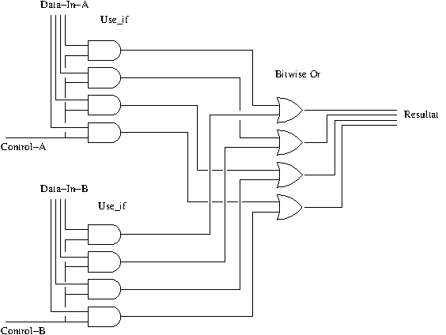

---
# Sådan laves en "er lig med"

~~~C
val is_equal(val a, val b) {
    val bitwise_diff = xor(a, b);
    bool equal = ! reduce_or(bitwise_diff);
    return equal
}
~~~
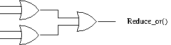

---
# Lagring af en enkelt bit

En RS latch (R=reset, S=Set)

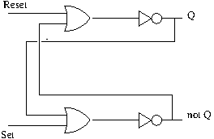

---

# Lagring af en enkelt bit (II)

En D-latch (D for Data). Opdateres sålænge 'open' er høj

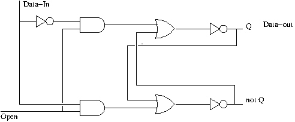

Undertiden kaldes en D-latch også for en SRAM-celle.

---
# Lagring af en enkelt bit (III)

En Kant-trigget D-latch. Opdateres på den stigende flanke af 'clk'

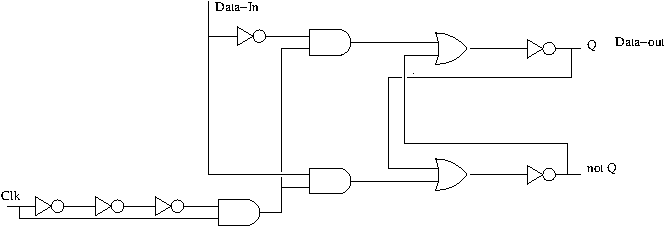

Et helt register kan bygges af D-latche. En til hver bit.

---
# En lager blok - Skriveport

En lagerblok består af et antal registre. 

Clk signalet til hver register betinges af at netop dette 
registers nummer er magen til det register nummer 
der drives på addresse indgangen.

Data på data indgangen føres frem til samtlige registre.

---
# En lager blok - Læseport

En stor multiplexor udvælger den ønskede værdi. Pseudokode
for en lager blok med 4 registre:

~~~C
val read_reg(val addr) {
    return or( or( use_if( is(0, addr), reg_0),
                   use_if( is(1, addr), reg_1))
               or( use_if( is(2, addr), reg_2),
                   use_if( is(3, addr), reg_3)));
}
~~~

Det skalerer ikke særlig godt. Så for store lagerblokke skal
der andre metoder i brug.
---
# Implementation af porte

Den grundlæggende funktionalitet kan implementeres på et utal af måder

Man kan f.eks. bruge tryk (luft eller vand) til at repræsentere 1 og mangel
på tryk til at repræsentere 0. Eller omvendt. Og så bygge en hel computer
op omkring det. Blot man kan lave en ventil der kan styres af tryk, så er
den ged barberet.

Man kan også finde nogle klodser i Minecraft og sætte dem sammen.

Men vi vil interessere os for implementationer i CMOS: Complementary
Metal Oxide Semiconductors.

---
# Transistorer

En transistor i CMOS er en kontakt som kan styres af en spænding.

Der er to slags transistorer.

 * PMOS: kontakten er åben, når der ikke er spænding på styreledningen

 * NMOS: kontakten er åben, når der er spænding på styreledningen

I CMOS bruges de altid parvis for at minimere strømforbrug.

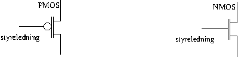

---
# Implementation af en inverter

Den simpleste digitallogiske byggeklods:

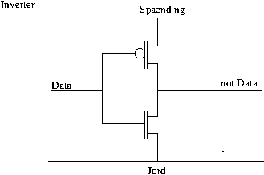

I CMOS skal man altid bruge PMOS transistorer til at løfte spændingen
(dvs forbinde direkte eller indirekte til strømforsyningen),
mens NMOS skal bruges til at sænke spændingen (dvs forbinde direkte
eller indirekte til "jord").

---
# Implementation af en Or-port

Og en Nor-port.

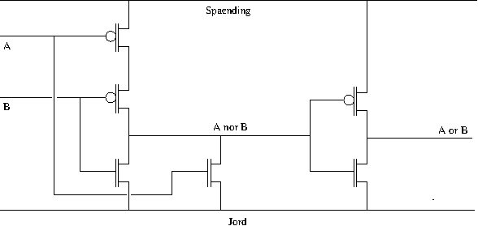

En Or-port laves af en Nor-port med en inverter bagefter
---
# Transistorer

Bedre end ventiler og vandslanger!

 * Holdbare: Ingen bevægelige dele (bortset fra elektroner)

 * Produceres ved en litografisk process.

 * Kan laves ekstremt små

 * Kan arbejde utroligt hurtigt (få pico-sekunder om at skifte,
   måske 5-20ps når de føder andre transistorer tæt på)

 * i CMOS omsættes tilstrækkelig lidt energi til at man kan
   integrere *mange* transistorer på meget lidt plads
   (over en milliard på en kvadrat-centimeter)

Wikipedia har en fornuftig artikel, hvis du vil grave: 
https://en.wikipedia.org/wiki/CMOS

Langt ude: http://visual6502.org/JSSim/expert-6800.html

---
# Transistorer (II)

 * Effekt er cirka proportional med skifte-frekvens, spænding
   og kredsløbets kapacitans

 * Vi kan påvirke skifte-frekvens på design tidspunktet

   * Design så ledninger skifter værdi så sjældent som muligt

   * F.eks. ved at stoppe for clock-signalet til de dele af
     chippen der ikke laver noget på et givent tidspunkt

 * Maksimal skifte-frekvens er cirka proportional med spænding

 * DVFS: Dynamic voltage-frequency scaling. Vi skruer løbende 
   op og ned for både spænding og clock-frekvens efter behov.

Alle nyere chips bruger DVFS.

---
# Produktionsproces

Sådan laver du en chip!

1. Reducer hele dit design til porte

2. Placer dine porte i et plan og forbind dem. 
   Også kaldet "place and route". Der er kun ganske få
   adskildte lag hvori forbindelser kan løbe.

3. Beregn alle forsinkelser for signaler under en
   række forskellige scenarier (varians i ledningsevne,
   forsyningsspænding, skifte-aktivitet)

4. Beregn herfra max clock frekvens og strømforbrug

5. Hvis du er utilfreds, start forfra

6. Oversæt dit design til "masker" der kan styre en
   efterfølgende litografisk process

7. Producer.

8. Test og sorter. Sælg!

---
# Moores lov

Moores lov er ikke en lov i samme forstand som tyngdeloven.

 * Moores lov er et løfte. En afstemning af forventninger og mål
   for den industri der laver produktionsprocessen. Et løfte om
   løbende at sikre inkrementel forbedring af den litografiske
   process.

 * Hver ny version af processen skal helst give transistorer
   som fylder halvt så meget som den foregående version

 * Hver version kaldes iøvrigt en "process node" og angives
   ved størrelsen af den mindste detalje der kan laves.

 * Vi har p.t. 14nm processen i brug, 10nm er ved at være der.

 * Hver opgradering til næste process-version er dyr. En fabrik
   koster ca 30 milliarder.

[Intel IDF 2014](file:mark-bohr-2014-reduced.pdf)

---
# Hvorfor hele tiden nye mikroarkitekturer?

 * For at udnytte at flere og flere transistorer er til rådighed
 * Men også fordi
   * Langsomme signal-skift giver forøget energiforbrug
   * Signal-skift bliver langsommere af at rejse langt eller drive
     andre transistorer
   * Forholdet mellem transistorens styrke og kapacitansen på
     ledninger rykkes lidt ved hver ny og forbedret process version
   * Kommunikation bliver dyrere relativt til beregning for hver
     ny og forbedret process version
 * (U)Kvalificeret Gæt: Det tager ca lige lang tid at tilgå 1KB 
   lager blok som at lave en 64-bit addition

---
# A2 mikroarkitektur - revisited

---

class: center, middle

# Spørgsmål og Svar

---

    </textarea>
    
    
  </body>
</html>
