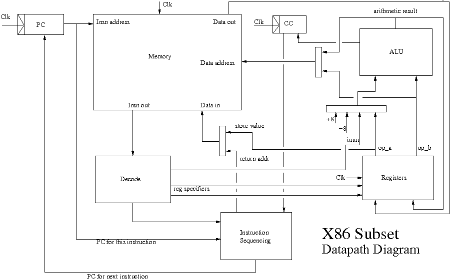
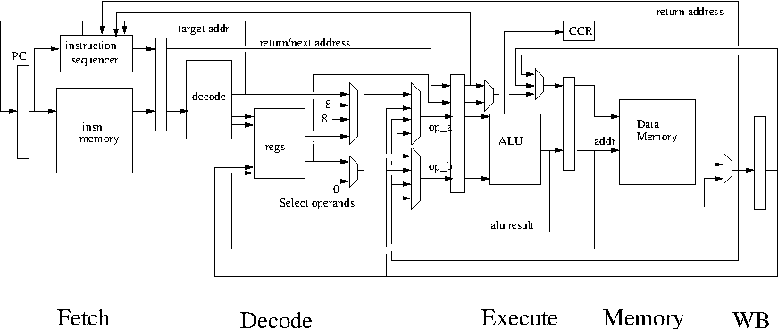

<!DOCTYPE html>
<html>
  <head>
    <title>Pipelining</title>
    <meta charset="utf-8">
    
  </head>
  <body>
    <textarea id="source">

# Ingen Kringler - Evaluering af A2

---

# A2 mikroarkitektur

---

# Oversigt over forelæsningerne i maskinarkitektur

1. En essentiel maskine bygget af nogle passende byggeklodser.
   Så simpelt som muligt - men ikke simplere. A2.

2. Et deep dive i hvordan klodserne bygges.
   Masser af detaljer der giver baggrund

3. Pipelining - hvorfor og hvordan?
   Performance! Mere performance! Hvor langt kan man gå? Hvordan?
   Mere realisme

4. Avanceret mikroarkitektur. 
   Parallel udførsel af sekventiel kode. Hvordan?
   "The bureaucracy is expanding to meet the need of the expanding bureaucracy"

5. Multitrådning. Multicore. Opsamling.

---

# Abstraktionsniveuaer

1. Gode programmeringssprog: Erlang, OCaml osv

2. Maskinnære programmeringssprog: C

3. Assembler / Symbolsk Maskinsprog: x86, ARM, MIPS

4. Arkitektur (ISA): Maskinsprog - ordrer indkodet som tal

5. Mikroarkitektur: ting som lager, registre, regneenheder, afkodere
   og hvordan de forbindes så det bliver en maskine

6. Standard celler: Simple funktioner af få bit (1-4) med et eller to resultater. Lagring af data (flip-flops)

7. Transistorer

8. Fysik. Eller noget der ligner

---

# Agenda

1. Hvad er pipelining?

2. Hvilke problemer skal man løse når man laver en pipeline

3. Hvilke teknikker tager man til hjælp

4. Pipelining i moderne CMOS (lager er laaaangsomt)

5. Ambitiøs? Flere instruktioner per clock?

---
# Hvad er pipelining

Pipelining går ud på at arrangere udførelsen af instruktioner som et samlebånd.
Den klassiske pipeline som man ofte ser i lærebøgerne har 5 trin:

 * 'F' for "fetch" - hentning af instruktion
 * 'D' for "decode" - afkodning
 * 'X' for "execute" - udførelse (ALU)
 * 'M' for "memory" - læsning fra lageret
 * 'W' for "writeback" - opdatering af registre

Ovenstående elementer findes også i mikroarkitekturen fra A2. Hvis vi for
eksemplets skyld antager at hvert element tager 1ns, så kan A2 køre 200MHz.

---
# A2 mikroarkitektur

---
# Pipelining

Ved pipelining adskiller man hvert trin med registre - så kan trinnene
udføres samtidigt, men med forskellige instruktioner i hvert sit trin.

~~~C
insn1  FDXMW
insn2   FDXMW
insn3    FDXMW
insn4     FDXMW
insn5      FDXMW
~~~

Antag at hvert "trin" tager 1 nanosekund. Så kan samlebåndet bevæge sig
med op mod en GHz. Udefra ser det ud som om de fleste instruktioner udføres på
en enkelt clock, men i virkeligheden er den samlede udførelsestid for en
instruktion forøget.

---
# "Structural hazards"

Det bliver ret besværligt, hvis samme hardware stump skal bruges fra
flere forskellige trin i pipelinen. Så skal man koordinere brugen.
Det kaldes en "structural hazard".

Bemærk: selvom vi kun har en memory - så har den separate porte, således
at man samtidigt både kan hente instruktioner (til "F"-trinnet) og data
(til "M"-trinnet).

Det kan også ske, at der er dele af maskinen man ikke ønsker at pipeline.
For eksempel er division alt for dyrt at pipeline og i stedet bruger man
en iterativ løsning.

---
# Data hazards

Hvis en instruktion skal bruge resultatet af den forrige ville vi gerne
kunne:
~~~C
insn            FDXMW
movq %r11,%r14   FDXMW
addq %r14,%r17    FDXMW
insn               FDXMW
~~~
Men ups - resultatet fra movq når først registrene i 'W' og skal læses i 'D'.
Det kaldes en "data hazard". En triviel løsning er at bremse pipelinen for de
senere instruktioner indtil det er sikkert at fortsætte. Det kaldes et "stall".
~~~C
insn            FDXMW
movq %r11,%r14   FDXMW
addq %r14,%r17    FDDDDXMW
insn               FFFFDXMW
~~~
Men det koster gevaldigt meget på ydeevnen
---

# Data afhængigheder - løsning i software

Simpelt! Compileren må indsætte instruktioner der er uafhængige!
~~~C
insn            FDXMW
movq %r11,%r14   FDXMW
uafh. insn        FDXMW
uafh. insn         FDXMW
uafh. insn          FDXMW
addq %r14,%r17       FDXMW
insn                  FDXMW
~~~
De tre instruktioner der skal være uafhængige siges at befinde sig i et 
"delay slot" eller "shaddow" af den foregående instruktion.

Det er sjældent muligt at finde nyttige instruktioner til at fylde i
sådan et "delay slot".

---
# Data afhængigheder - løsning i hardware

Hardware løsning: Vi tilføjer dedikerede forbindelser fra resultat-siden af
ALUen til der hvor værdierne skal bruges.
~~~C
insn            FDXMW
movq %r11,%r14   FDXMW
addq %r14,%r17    FDXMW
insn               FDXMW
~~~
Det kaldes "bypassing" eller "forwarding". Det vil koste lidt på
clockfrekvensen i forhold til hvis man ikke har bypassing. Men gevinsten
er stor.

Moderne maskiner løser alle data afhængigheder i hardware. En del
ældre maskiner (nu døde eller meget ildelugtende) har "delay slots"
som programmør (eller compiler) skal fylde. Om ikke andet, så med "nop".

---
# A2 pipelined

Simpel fem-trins pipeline med fuld forwarding/bypassing. 

Bemærk hvordan der er indskudt registre (såkaldte pipeline-registre) foran
afkoderen, ALUen, data-cachen og til sidst, før skrivning til registrene.

---
# Langsommere instruktioner

Det er ikke alle instruktioner der udføres i et enkelt trin - kun de 
aritmetisk/logiske. Læsning fra lageret har først et resultat efter
'M' trinnet:
~~~C
insn               FDXMW
movq 4(%r11),%r14   FDXMW
addq %r14,%r17       FDDXMW
insn                  FFDXMW
~~~
her er der ikke noget at gøre. Selv med "forwarding" (eller "bypassing")
må den afhængige instruktion forsinkes indtil data når frem.

Vi siger at movq-instruktionen har en "skygge" på en instruktion. Hvis
vi kan finde en uafhængig instruktion at placere i skyggen behøver vi ikke
at bremse pipelinen.

---
# kald og retur

Kald og retur udgør en anden udfordring. Betragt:

~~~C
insn         FDXMW
jmp           FDXMW
insn efter     F
jmp-target      FDXMW
~~~
Her skal vi have hentet jmp-instruktion og afkodet den før vi kan hoppe.
Og når vi finder ud af vi skal hoppe har vi allerede hentet den næste
instruktion - som slet ikke skal udføres!

Retur er værre:
~~~C
insn         FDXMW
ret           FDXMW       <-- retur addresse tilgænglig efter M
insn efter     F
jmp-target        FDXMW   <-- måske kan vi overlappe F med W for ret?
~~~
---
# Betingede hop

Betingede hop er også en udfordring. Vi kan godt genkende og reagere i
'D'-trinnet. Men hvordan? Vi ved jo ikke endnu om hoppet skal tages eller
ej. Vi kan først afgøre hoppet når en eventuel tidligere instruktion har
opdateret CCR:
~~~C
insn             FDXMW
cmpq %r11,%r12    FDXMW      <-- CCR opdateres efter X, "bypasses"
jge target         FDXMW     <-- vi kan afgøre hop i 'X'
<shaddow>           FD       <-- og slå de her instruktioner ihjel
<shaddow+1>          F
target: insn          FDXMW  <-- og starte hentning
~~~
Her koster hoppet 2 ekstra clock cykler, 3 i alt. Men bemærk at hvis 
hoppet *ikke* skal tages, så fortsætter pipelinen normalt, og så 
koster hoppet kun en enkelt cyklus.

---
# En mere realistisk pipeline

I nyere CMOS teknologi er kommunikation relativt set blevet langsommere
end beregning. Derfor er den simple 5-trins pipeline ikke realistisk.
Det tager *meget* længere tid at tilgå lageret end at lægge tal sammen.

Derfor organiserer man lageret i et hierarki. Tættest på ALU og registre
placeres L1-caches. Længere ude L2-caches. Og i mange tilfælge også L3
caches. Når man skal læse noget fra lageret kigger man først i L1, så L2,
så L3 før man "går off-chip" og snakker med lagerkredsene ude på bundkortet.

Men selvom man gør L1-cachen lille, så er den stadig for langsom til at kunne
tilgås på en enkelt clock cyklus. Følgende er relativt almindeligt:

* L1: 16KB-64KB, 2-4 clock cykler
* L2: 256KB-1MB, 11-20 clock cykler
* L3: 1-4MB, 20-40 clock cykler
* Lager: GBytes, 100-200 clock cykler.

---
# En pipeline med 3 cycle cache opslag

Det påvirker både hentning af instruktioner og hentning af data. Her eksemplet
fra før:
~~~C
insn               F..DXM..W
movq 4(%r11),%r14   F..DXM..W
addq %r14,%r17       F..DDDDXM..W   <-- forsinkes nu 3 cykler
insn                  FF....DXM..W
~~~
Movq kaster nu en skygge på 3 instruktioner. Og her det betingede hop:
~~~C
insn             F..DXM..W
cmpq %r11,%r12    F..DXM..W      <-- CCR opdateres efter X, "bypasses"
jge target         F..DXM..W     <-- vi kan afgøre hop i 'X'
<shaddow>           F..D         <-- og slå de her instruktioner ihjel
<shaddow+1>          F..
...                   F.
target: insn            F..DXM..W  <-- og starte hentning
~~~
Prisen er nu 5 cykler for et taget hop, stadig en cyklus for et ikke taget hop.
Den gennemsnitlige afstand mellem hop er 6 instruktioner! Vi kører på halv
hastighed!

---
# Hvis i tvivl - GÆT!

Over tid har man udviklet forskellige teknikker til at klare hop, kald og
retur i lange pipelines - her er tre af dem:
 * "branch target caching" - en lille cache der associerer en del af adressen på
   et hop med de første instruktioner der hoppes til. Gør det muligt at have
   instruktionerne på target-addressen klar så snart man afkoder et hop.
 * Retur forudsigelse - en lillebitte hardware stak (f.eks. 8 addresser)
   placeret i afkoderen ('D'-trinnet) så man kan få retur adresen uden at
   vente på at den poppes fra lageret.
 * Hop forudsigelse - forudsigelse af om et betinget hop skal tages
   eller ej baseret på kontekst.
Jo dybere pipeline, jo vigtigere er disse teknikker

Vi nøjes med at kigge lidt nærmere på hop forudsigelse

---
# Hop-forudsigelse

Ofte kan man forudsige om et hop skal tages eller ej. F.eks. vil hop der
lukker en løkke (og hopper tilbage til begyndelsen af løkken) oftest skulle
tages.

En simpel forudsigelse kunne være at hop der går bagud skal tages, men dem
der hopper til en senere adresse skal ikke. Lidt mere fleksibelt er det hvis
en compiler kan markere sin forudsigelse så hardwaren kan se den.

Desværre er hop ret dynamiske, så statiske (altså compile-time) metoder
har kun begrænset succes. Der skal dynamiske metoder til.

---
# Dynamisk hop-forudsigelse

Dynamisk hop-forudsigelse opsamler data fra hoppenes historie og brugder
det til at forudsige den fremtidige opførsel.

Den simpleste udgave betragter hvert hop for sig. Man knytter en to-bit
tæller til hver hop, i praksis ved at lave en række af tællere og bruge
nogle bits fra PC'en til at vælge en tæller. Hver tæller opsumerer hoppets
historie:
~~~
00 hop ikke taget (strongly not taken)
01 hop almindeligvis ikke taget (weakly not taken)
10 hop almindeligvis taget (weakly taken)
11 hop taget (strongly taken
~~~
Hver gang et hop afgøres opdateres den matchende tæller, enten i retning
mod "hop ikke taget", eller mod "hop taget".

Dette kaldes "local" hop forudsigelse - fordi man betragter hvert
betinget hop adskilt fra de andre.

---
# Superscalar pipelining

Fint ord for mere end en instruktion per clock

Det begynder med følgende observation: cache adgang koster meget hardware. 
Hvis vi har lavet hardware med mulighed for en adgang pr clock, så lad 
os udnytte det!  Skaler resten af maskinen så der typisk er brug for 
cachen hver clock.

Masser af nye udfordringer

 * Kan man nå lige så høj clock frekvens som en almindelig scalar pipeline?
 * Kan man udnytte sådan en maskine, eller dør den fordi data afhængigheder
   kræver at pipelinen bremses ("stalles") ?

---
# Clockfrekvens for superskalare pipelines

De kritiske signalveje i en superskalar processor er almindeligvis ALU'en
(ALU'erne) og det forwarding/bypassing netværk der forbinder dem.

Når man indsætter flere ALU'er vokser det netværk, hvilket kan føre
til forøgelse af clokck-perioden. Ofte kan man imødegå den tendens
ved at dedikere ALU'erne til hver sin delmængde af operationer. Herved
bliver den enkelte ALU lidt simplere og hurtigere.

Så længe man ikke er for ambitiøs er disse signalveje imidlertid stort
set magen til dem i den simplere, ikke superskalare, pipeline. Det skyldes
at den simplere pipeline også har brug for alle de samme funktioner og har
det samme behov for at kunne forwarde resultater mellem instruktioner.

I praksis har det vist sig at superskalare maskiner har kunnet nå
samme clock frekvens som simplere ikke superskalare maskiner.

De fleste processorer er i dag superskalare. Selv på de langsommere
smart-phones.

---
# Data afhængigheder

I en superskalar pipeline er der langt flere mulige "stalls" på grund af
data afhængigheder. Betragt flg 2-vejs superskalare pipeline:
~~~C
insn                F..DXM..W
movq 4(%r11),%r14   F..DXM..W
addq %r14,%r17       F..DDDDXM..W   <-- forsinkes 3 cykler
insn                 F.....DXM..W
~~~
Forsinkelsen er den samme som i den simplere pipeline (3 cykler), men da
der ellers kan pumpes dobbelt så mange instruktioner igennem er "skyggen"
efter movq-instruktionen dobbelt så lang, 6 instruktioner.

For en superscalar pipeline er det endnu vigtigere med ordentlig forudsigelse

---
# Korrelerende hop-forudsigelse

Hop er ofte korrelerede med andre hop. Det kan man udnytte ved at opsamle
hoppenes historie. En simpel fremgangsmåde er at indkode historien i et
skifte-register. Når et hop tages skifter man '1' ind i skifteregisteret.
Når et hop ikke tages skifter man '0' ind.

Som før har man en tabel af to-bit tællere der opdateres på samme måde
som beskrevet for lokale forudsigere.

For at lave en forudsigelse laver man et "hash" af skifteregisteret og PC'en
og bruger det til at slå op i tabellen med tællere. Bitvis XOR er en fin 
hash funktion i det her tilfælde.

Denne forudsiger kaldes "gshare" og kan ofte levere mere end 90% korrekte
forudsigelser.

Der findes andre og betydeligt mere omfattende forudsigere der fungerer
endnu bedre. Generelt skal man ikke tro at man kan forudsige sine egne hop
bedre end maskinen kan.

---
# Opsamling

Pyha - vi er nået langt fra den simple mikroarkitektur for A2
 * Vi har introduceret et realistisk lager hierarki
 * Vi har introduceret en realistisk pipeline - som kører med
   5x højere clock frekvens en A2 - og forhåbentligt kan afvikle
   virkelige programmer ~4x hurtigere
 * Vi har kigget på de problemer hardware-ingeniørerne skal løse
   undervejs, når de laver en pipelinet maskine
 * Vi har også introduceret de mere ambitiøse superskalare pipelines
   som er vidt udbredte, selv i batteridrevne enheder som smartphones.

Kan en 2-vejs superskalar køre dit program 2x hurtigere end den simplere
skalare pipeline? Kan en 4-vejs mon køre det 4x hurtigere?

Det varierer voldsomt fra program til program hvor meget der vindes.

Vi har lavet en performance simulator for at belyse den slags spørgsmål!

---

class: center, middle

# Spørgsmål og Svar

---

    </textarea>
    
    
  </body>
</html>
