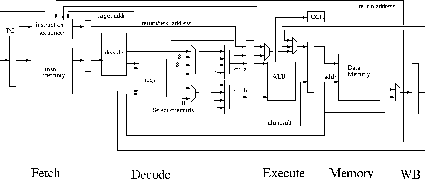
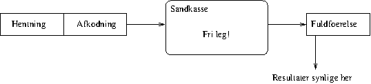
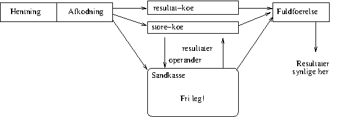
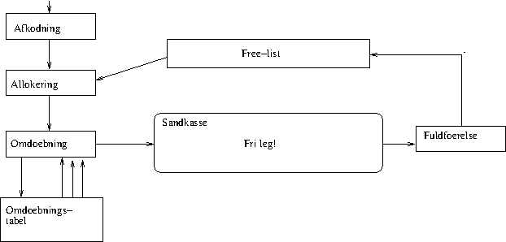
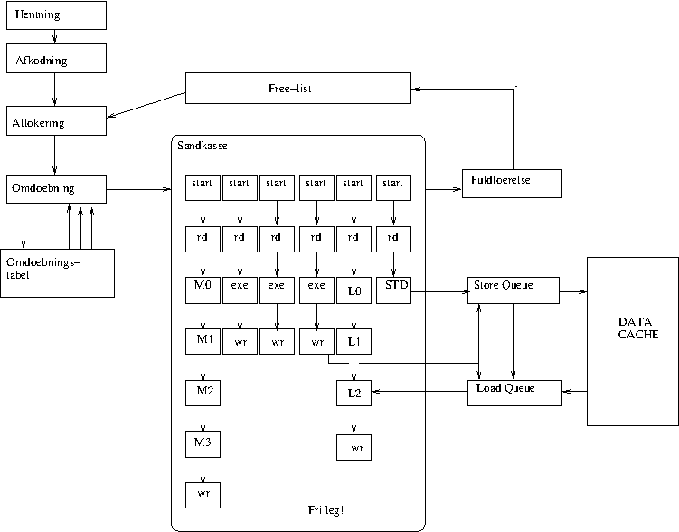
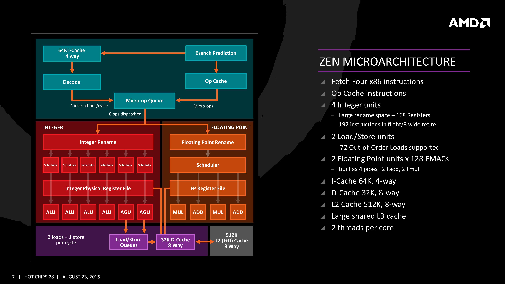
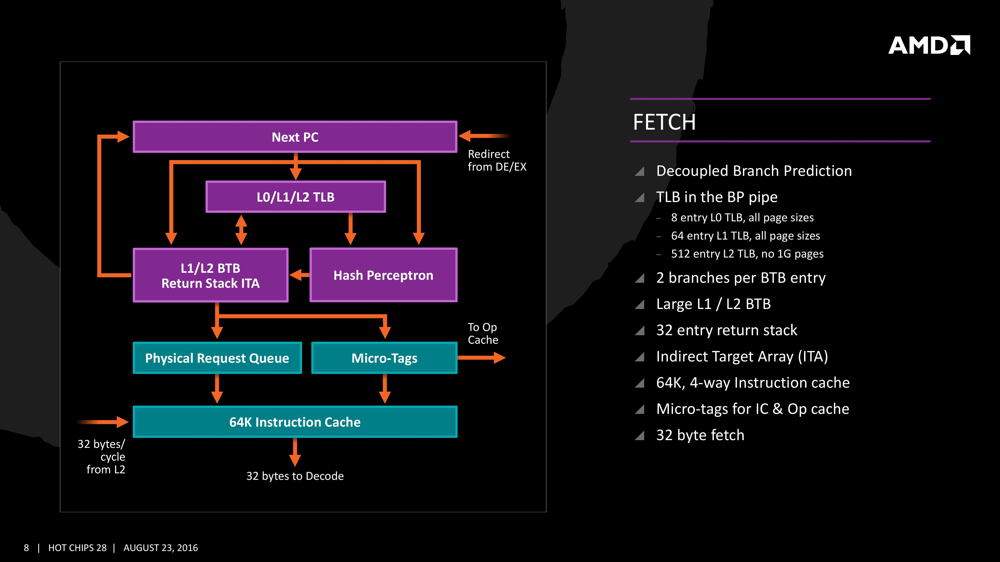
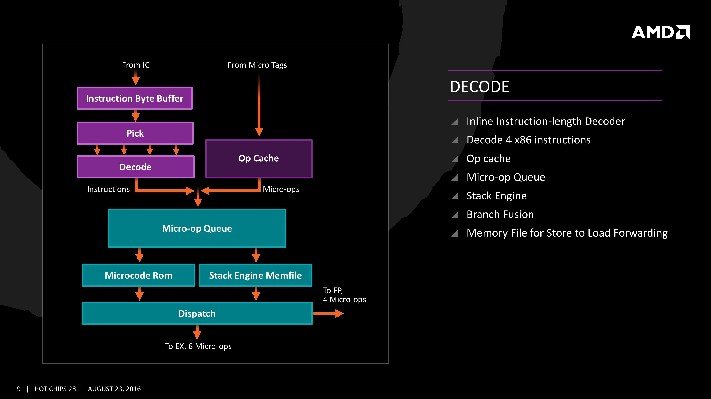
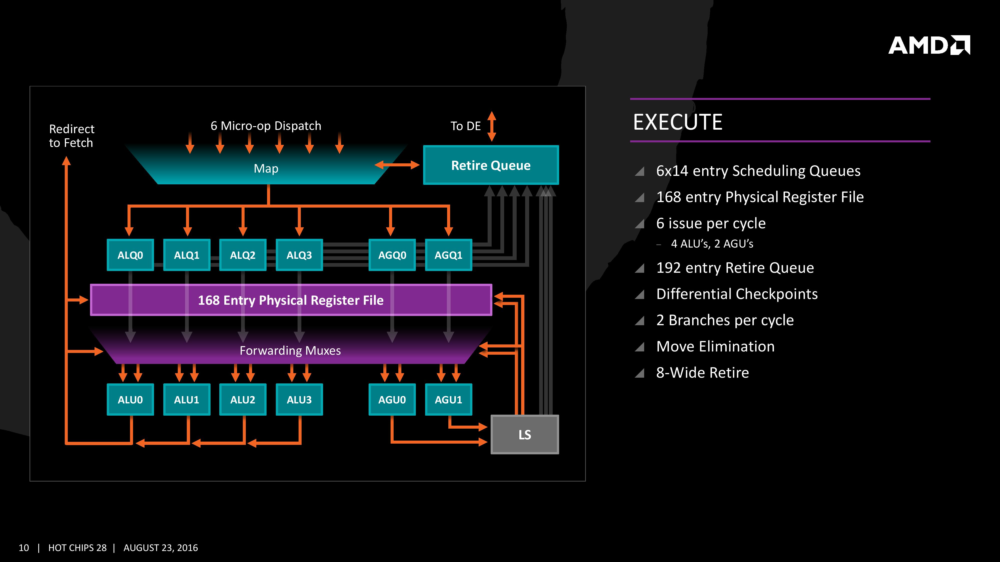
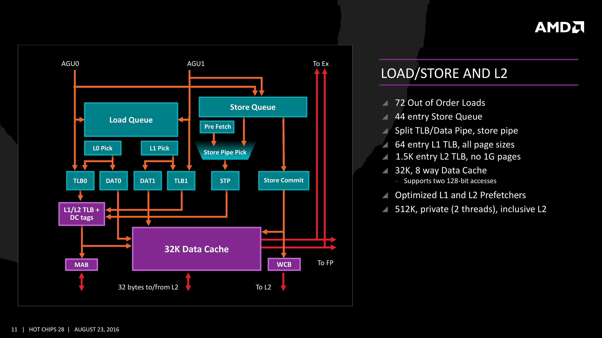

<!DOCTYPE html>
<html>
  <head>
    <title>Out-of-order execution</title>
    <meta charset="utf-8">
    
  </head>
  <body>
    <textarea id="source">

# A2 pipelined!

---

# Oversigt over forelæsningerne i maskinarkitektur

1. En essentiel maskine bygget af nogle passende byggeklodser.
   Så simpelt som muligt - men ikke simplere. A2.

2. Et deep dive i hvordan klodserne bygges.
   Masser af detaljer der giver baggrund

3. Pipelining - hvorfor og hvordan?
   Performance! Mere performance! Hvor langt kan man gå? Hvordan?
   Mere realisme

4. Avanceret mikroarkitektur. 
   Parallel udførsel af sekventiel kode. Hvordan?
   "The bureaucracy is expanding to meet the need of the expanding bureaucracy"

5. Multitrådning. Multicore. Multi-noget. Opsamling.

---

# Abstraktionsniveuaer

1. Gode programmeringssprog: Erlang, OCaml osv

2. Maskinnære programmeringssprog: C

3. Assembler / Symbolsk Maskinsprog: x86, ARM, MIPS

4. Arkitektur (ISA): Maskinsprog - ordrer indkodet som tal

5. Mikroarkitektur: ting som lager, registre, regneenheder, afkodere
   og hvordan de forbindes så det bliver en maskine

6. Standard celler: Simple funktioner af få bit (1-4) med et eller to resultater. Lagring af data (flip-flops)

7. Transistorer

8. Fysik. Eller noget der ligner

---
class: center, middle

# Out-of-order execution

---

# Agenda

1. Hvad er out-of-order execution
2. Hvorfor er det en god ide?
3. De væsentligste elementer i out-of-order execution
4. Implementation
8. Opsamling

---
# Hvad er out-of-order execution

Out-of-order execution går ud på at optimere afviklingen af et program,
ved at udføre instruktioner i den rækkefølge som data-afhængighederne
mellem dem tillader. Selvfølgelig inden for de begrænsninger som er givet
af de ressourcer der er til rådighed.

Out-of-order har ikke noget at gøre med "at være i stykker"

Mere specifikt går det ud på at udføre denne optimering på køre-tid, 
i modsætning til at lade en oversætte tilrettelægge afviklingen.

---
# Hvorfor er det en god ide?

Et program på maskinsprogsniveau har en sekventiel semantik. Ordrer
udføres en ad gangen (konceptuelt). Selv når man som programmør ikke
ønsker det sådan.

F.eks. er man ofte ligeglad med om
~~~C
  int a = b*c + d*e
~~~
bliver beregnet som
~~~C
  int a0 = b*c;
  int a1 = d*e;
  int a = a0+a1
~~~
eller
~~~C
  int a1 = d*e;
  int a0 = b*c;
  int a = a0+a1
~~~
Men compileren er nød til at træffe et valg og fastlægge en rækkefølge.

---
# Hvorfor er det en god ide (II) ?

Et endnu tydeligere eksempel er løkker
~~~C
  for (j=0; j<MAX; ++j) {
    res += (*a++) * (*b++);
  }
~~~
Her er vi tvunget til at beskrive beregningen som et antal gennemløb
af løkke-kroppen der foregår en efter en.
~~~
loop:
  movq 0(%r_a),%r10  XXXX         <--- tidligst mulige udførelse
  addq %r_8,%ra      X
  movq 0(%r_b),%r11  XXXX
  addq %r_8,%rb      X
  addq %r_1,%r_j     X
  mulq %r10,%r11         XXXX
  cmpq %r_j,%r_MAX    X
  addq %r_res                X
  bg loop              X
~~~
Vi kunne starte en ny tur efter 3 cykler, men beregningerne tager 9.

---
# De væsentligste elementer i out-of-order execution

Out-of-order execution, eller "dynamisk udførelse" beror på tre principper:

   1. Udførelsesrækkefølge fastlægges ud fra afhængigheder mellem instruktioner
   2. Spekulativ udførelse: Instruktioner udføres aggressivt i en "sandkasse"
   3. Forudsigelse af programforløb gør det muligt at "fylde sandkassen" hurtigt

Hvorfor skal vi have en "sandkasse" ?

---
# Implementation - en sandkasse

For at kunne lave en sandkasse skal vi isolere effekten af instruktioner
indtil vi ved at de skal udføres. Man kunne lagre resultater i to køer:

1. Resultat-kø - udestående skrivninger til registre
2. Store-kø - udestående skrivninger til lageret

Når man så skal finde indholdet af et register, må man søge igennem
resultat-køen og finde den rette skrivning til registeret (der kan være
mange). På samme måde må læsning fra lageret konsultere store-køen for
at finde en eventuel skrivning til lageret.

---
# Centrale elementer af sandkassen

Sandkassen er der hvor vi udfører instruktionerne. Pænt afskærmet
fra resten af verden. Om nødvendigt kan vi gå amok og regne forkert,
bare vi korrigerer i tide. De centrale elementer i sandkassen er:

   1. Registeromdøbning - giv hvert resultat en unik ID
   2. Planlægning af udførelsesrækkefølge, "scheduling"
   3. Styring af forwarding
   4. Læsning fra lageret

---
# Registeromdøbning

Det er nødvendigt at kunne identificere hvert eneste resultat på en
simpel og hurtig måde. Derfor giver vi hvert resultat en unik ID. Denne ID
tildeles når en instruktion lukkes ind i sandkassen.

Alle referencer til registre erstattes med den unikke ID for den værdi
der sidst er skrevet til det pågældende register - også før værdien faktisk
er tilgængelig. Inden i sandkassen er alle referencer til register (også CCR)
erstattet med unikke resultat numre.

Denne proces kaldes register-omdøbning

---
# Sådan arbejder registeromdøberen

1. Resultat-ID'er allokeres fra en fri-liste.
2. Registre slås op i en omdøbnings-tabel. Tabellen indeholder for hvert
   register den seneste resultat-ID. Det *tidligere* Resultat-ID for 
   destinations-registeret følges med instruktionen rundt i sandkassen
3. Tabellen opdateres med de nye resultat-ID'er
4. Når instruktionen engang er færdiggjort med succes og alle tidligere
   instruktioner også er færdiggjort med succes, fuldfører vi instruktionen
   (også kaldet "commit") ved at tilføje det *tidligere* resultat-ID til 
   fri-listen

---
# Register omdøbning og forkerte forudsigelser

Af og til vil et programforløb blive forudsagt forkert. Så skal
nogle af instruktionerne i sandkassen smides ud. Alle deres resultat-ID'er
skal frigives. Effekten af dem, udført eller måske delvist udført skal
slettes.

1. Allokering fra frilisten er bare at flytte en peger ind i en 
   cirkulær buffer. Vi kan tage backup af den peger, så den kan
   retableres når vi har brug for det.

2. Tilsvarende kan vi tage en backup af omdøbnings-tabellen for hver
   eneste forudsigelse vi laver. Så kan vi retablere indholdet af
   tabellen meget hurtigt.

Vi kan gøre vores sandkasse klar til at modtage nye instruktioner efter
en fejlagtig forudsigelse på ganske få clocks. Mindst ligeså hurtigt som
det tager at hente de rette instruktioner.

---

# Planlægning af udførelsesrækkefølge, "scheduling"

Et særligt planlægnings-kredsløb er ansvarligt for at fastlægge hvornår
instruktioner skal udføres. Planlægnings-kredsløbet kan bedst opfattes som
en form for "aktiv" hukommelse hvori instruktionerne afventer deres operander.

For hver instruktion er sammenlignes de indgående resultat-ID'er som instruktionen 
skal bruge, med resultat-ID'er for de resultater der snart vil blive produceret.

Når en instruktion således har "observeret" alle de resultat-ID'er som den har
brug for, bliver den markeret som "parat". Flere instruktioner kan blive parat
samtidigt.

Et prioriteringskredsløb udvælger så den instruktion som kan få lov at starte
blandt de instruktioner der er parate. Nu er instruktionen "startet". Dens resultat-ID
vil i en senere clock-cyklus blive ført tilbage til planlæggeren for få startet
afhængige instruktioner.

Der findes både maskiner med flere små planlægningskredsløb som hver maximalt
starter en instruktion per clock, og maskiner med færre store planlægninskredsløb
som kan starte flere instruktioner per clock.

---
# Planlægning og fejl-planlægning

Planlægning finder sted nogle få cykler før udførelse. For nogle instruktioner
ved man præcis hvor lang tid de er om at producere et resultat (add: 1 clk, mult 4 clk),
men for andre kan man ikke vide det på forhånd (data cache læsning: 3 clk hvis L1 hit,
12 clk hvis L2 hit, ....)

For disse resultater udføres planlægningen enten på basis af typisk opførsel,
eller på basis af en dynamisk forudsigelse (hvis i tvivl? - gæt!).

I begge tilfælde kan en planlægning være forkert. Det kan føre til at en instruktion
starter før dens operander er tilgængelige og derfor regner forkert. Principielt
kan man finde de berørte instruktioner og genstarte kun dem, men en simplere løsning
er at nulstille alle instruktioner der er startet i de berørte clock-cykler,
retablere tilstanden i planlægninskredsløbet fra en tidligere cyklus, known-good cyklus
og genstarte planlægningen. Det kræver at der tages backup af tilstanden i
planlæggeren hver cyklus.

---
# Styring af forwarding

Forwarding fra en instruktion til en afhængig instruktion sker præcis som i almindelige
pipelines. Der kan være flere regne-enheder der skal forbindes, men konceptuelt er
det faktisk simplere at forwarde i en out-of-order maskine end i en superskalar.

Det skyldes at resultaterne i en out-of-order maskine er identificeret med et unikt
resultat-ID. Til sammenligning er resultater i de simplere maskiner identificeret med
register numre, som kan være i brug flere steder i pipelinen samtidig. Det kræver en
efterfølgende prioritering sådan at en modtager altid får den rette "udgave" af et register.

I en out-of-order maskine kan styresignalerne til forwarding multiplexerne sættes
af planlægningskredsløbet og så følge instruktionen ned igennem pipelinen.

Det er aldrig nødvendigt at "bremse" en pipeline inden i sandkassen. Instruktioner
starter først når man ved at de kan gennemføres (med undtagelse af ved fejl-planlægning).

---
# Overblik over mikroarkitekturen

---
# Læsning fra lageret

Skrivninger til lageret skal blive i sandkassen. Derfor har vi tilføjet en
store-kø. Det har betydninger for læsninger fra lageret:

* Før (eller samtidigt med cache opslag) må man søge i store-køen efter
  skrivninger som overlapper med den læsning man vil lave.
* Der kan allerede være relevante data i store køen.
* Eller der kan være en markering i store køen af at der vil blive
  skrevet til den ønskede adresse senere
* Der kan være en partiel match: nogle bytes er i store køen, evt tilknyttet
  forskellige ventende store instruktioner, og nogle bytes der skal læses
  fra cachen
* Der kan være en ældre skrivning, hvor adressen endnu ikke er beregnet.
  Hvad gør man så?

De fleste out-of-order maskiner kan forwarde store data til en ventende load,
hvis der er fuldt match, men venter med at fuldføre loads der har partielt match
indtil alle relevante store instruktioner er fuldført, har forladt store-køen
og har opdateret cachen

I alle maskiner er det nødvendigt at kunne sætte load instruktionerne i en
kø, hvor de kan afvente at de får lov til at tilgå cache eller kan opsamle
de relevante data fra store-køen.

---
# Typisk Out-of-order mikroarkitektur

---
# Implementation - afkodning

Det er her der skal tages særlige hensyn til x86

   1. Oversættelse til intern form
   2. Re-kombinering
   3. Stak
   4. L0-cache

For RISC maskiner, f.eks. ARM passer instruktionerne ret godt til internt
brug.

---
# Oversættelse til intern form

Det er vigtigt at instruktionerne inden i en out-of-order maskine er
meget ensartet repræsenteret. Derved bliver de mange kredsløb vi har
set på mere regulære og nemmere at implementere. Især planlæggeren.

Generelt skal instruktioner nedbrydes så de passer til hvad planlægnings-
kredsløbet kan håndtere. Betragt for eksempel addq %r11,200(%r9). Denne 
instruktion skal både læse fra lageret og skrive et resultat tilbage til det.
I den simpleste (og mest regulære) implementation vil den blive brudt ned til
tre mindre instruktioner:
~~~
movq 200(%r9),%tmp
addq %r11,%tmp
movq %tmp,200(%r9)
~~~
Som så kan planlægges individuelt.

---
# Instruktions kombinering

Det kan også nogle gange betale sig (nu man er i gang, og der er millioner
af transistorer at tage fra) at kombinere instruktioner. Et eksempel:
~~~
   cmpq %r11,%r13
   jg target
~~~
kan kombineres til
~~~
   cmpg-and-jg %r11,%r13,target
~~~
hvilket typisk kan spare en clock-cyklus. Et andet eksempel:
~~~
   movq %r11,%r12
   addq %r13,%r12
~~~
omskrives til:
~~~
   addq %r11,%r13 -> %r12
~~~
Det kaldes "move elimination".

---
# Stak

x86 bruger stakken via push og pop meget mere end andre maskiner. Det er
både en forbandelse (fordi push og pop er lidt komplicerede) og en
potentielt gevinst. Gevinsten kommer fordi det er muligt at følge de
ændringer der vil ske til %rsp mens instruktionerne passerer afkodningen.

Det kan bruges til at implementere en speciel indre stak som indeholder
de sidst "pushede" værdier, hvilket kan gøre læsning af værdierne på toppen
af stakken hurtigere.

Samspillet med store-kø, load-kø og omdøbning er ikke trivielt.

---
# Level-0 cache

Afkodning af x86 instruktioner er besværligt. Det giver en lang pipeline.
Det koster ekstra strøm. Det gør fejl-forudsigelser dyrere. 

Nyere implementationer af x86 har en mindre
level-0 cache som indeholder instruktioner på afkodet form.

Når instruktioner findes der, behøver man ikke at tilgå den almindelige
instruktions-cache.

---
# Bedre forudsigelse af programforløb

En out-of-order maskine kan arbejde på flere hundrede instruktioner
ad gangen. Kvaliteten af forudsigelsen af programforløbet er absolut
afgørende for at kunne hente så mange instruktioner hurtigt.

Derfor anvender man korrelerende forudsigere som finder mønstre
i programmets historie og bruger disse mønstre til forudsigelse.
Den gshare-forudsiger jeg introducerede i en tidligere forelæsning
er ikke god nok til en stor maskine.

Der er foreslået forudsigere som er realistiske at bygge, og som kan
levere 200-500 instruktioner mellem hver fejl forudsigelse for et
repræsentativt udsnit af programmer. 

Vi ved ikke præcis hvilke forudsigere AMD og Intel bruger. De holder
kortene tæt ind til kroppen.

---
# En rigtig x86 (AMD Ryzen) - overblik

---
# En rigtig x86 (AMD Ryzen) - hentning

---
# En rigtig x86 (AMD Ryzen) - x86 overhead

---
# En rigtig x86 (AMD Ryzen) - x86 sandkasse

---
# En rigtig x86 (AMD Ryzen) - load/store

---
# Opsamling - forudsigelser

Bemærk den rolle dynamiske forudsigelser spiller:

 * Retur-forudsigelse
 * Betinget-hop forudsigelse
 * Forudsigelse af destinations-adresse for hop og kald
 * Hit/miss-forudsigelse - for at minimere fejlagtig planlægning
 * Alias forudsigelse (forudsigelse af om en læsning fra
   lageret rammer en tidligere skrivning)

Jo højere ydeevne, jo større brug af og krav til forudsigere.

---
# Opsamling - big picture

Jagten på ydeevne har ledt os til nogle forbløffende komplicerede
mikroarkitekturer. Deres design er i væsentlig grad *uafhængig*
af det instruktions-sæt de skal udføre. ARM eller x86? Det
er grundlæggende den samme struktur der er under motorhjelmen!

Man skulle tro det kunne lade sig gøre at få samme ydeevne med
et simplere design. Men den historiske udvikling er brolagt med fejlede 
forsøg på at opnå samme ydeevne uden brug af dynamisk planlægning af
udførelsen. (Google: "itanic")

Det ser ud til at out-of-order maskinerne på en eller anden måde
indtager et sweet-spot i computer arkitektur. De er ganske enerådende
blandt de højest ydende maskiner. Selv i scenarier man opfatter som
relativt sensitive overfor energiforbrug, såsom smartphones, anvender man
out-of-order superskalare pipelines.

Men ja, en Nokia 3310 kører længere på en opladning :-D

---

class: center, middle

# Spørgsmål og Svar

---

    </textarea>
    
    
  </body>
</html>
